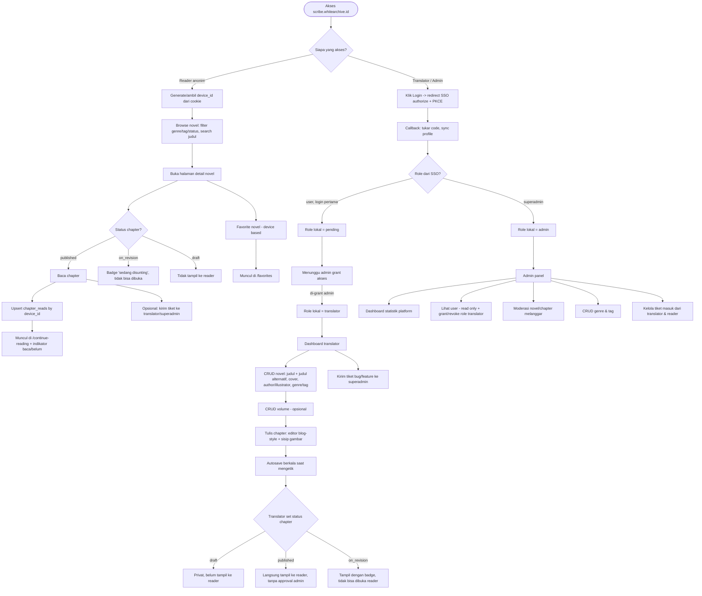
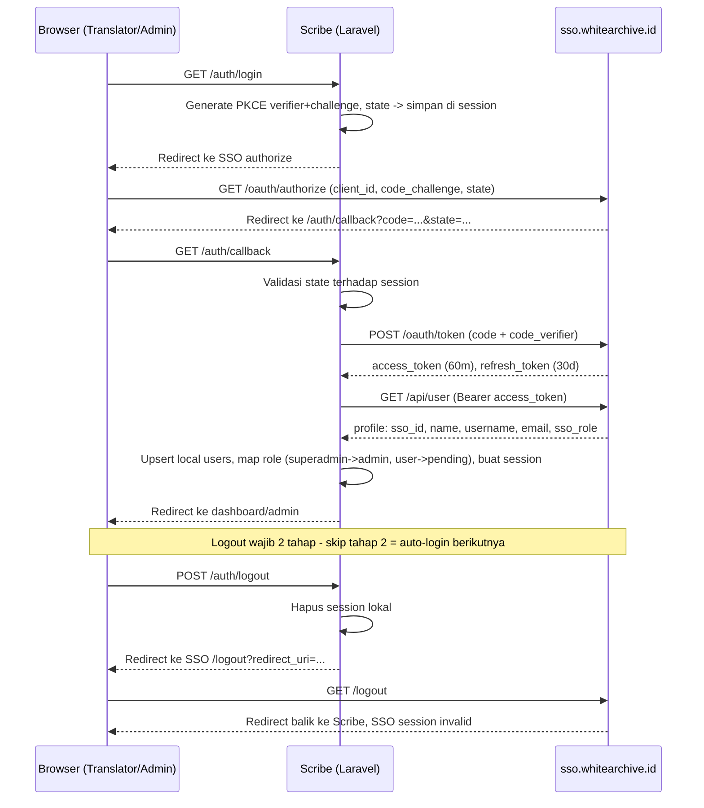

# Scribe — User Flow & Auth Sequence

## Alur Utama (Reader, Translator, Admin)

---

## SSO Auth Sequence (Login & Logout 2 Tahap)

---

## Catatan

- Reader tidak pernah menyentuh alur SSO — seluruh interaksi reader anonim, murni berbasis `device_id` di cookie/localStorage.
- Tidak ada langkah approval/publish-request antara "translator set published" dan "chapter tampil ke reader" — platform terpusat, publish langsung.
- Chapter `on_revision` tetap ada di database dan tetap terhubung ke novel/volume-nya, hanya disembunyikan dari akses baca reader.
