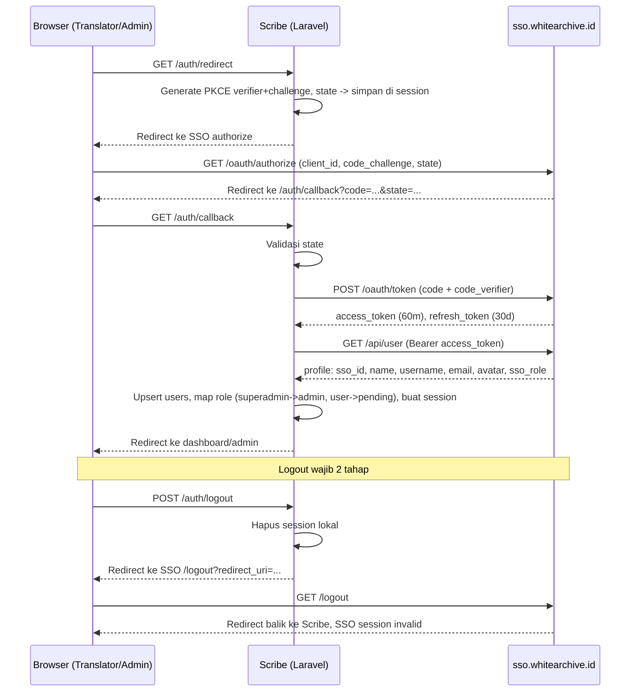

# FLOWS — Scribe

Navigation map + user flows. Untuk skema DB & folder structure lihat [`ARCHITECTURE.md`](ARCHITECTURE.md).

---

## Alur Utama

```mermaid
flowchart TD
    Start([Akses scribe.whitearchive.id]) --> Visitor{Siapa yang akses?}

    Visitor -->|Reader anonim| RDevice[Cookie device_id di-assign otomatis]
    RDevice --> RHome[Beranda: katalog + filter genre/tag/status + search]
    RHome --> RDetail[Detail novel: sinopsis, alt titles, author/illustrator, chapter list per volume]
    RDetail --> RChapterStatus{Status chapter?}
    RChapterStatus -->|published| RRead[Baca chapter]
    RChapterStatus -->|on_revision| RBadge["Badge 'sedang disunting', tidak bisa dibuka"]
    RChapterStatus -->|draft| RHidden[Tidak tampil]
    RRead --> RTrack[Upsert chapter_reads]
    RTrack --> RContinue["/continue-reading + indikator baca/belum"]
    RDetail --> RFav[Favorite - device based]
    RFav --> RFavPage[/favorites]
    RRead --> RTicket["Opsional: kirim tiket ke translator/admin"]
    RHome --> RSearch["Global Search (Ctrl+K) - tanpa login"]

    Visitor -->|Translator/Admin| SSOLogin[Klik Login -> redirect SSO authorize PKCE]
    SSOLogin --> SSOCallback[Callback: tukar code, sync profil]
    SSOCallback --> RoleMap{Role dari SSO?}
    RoleMap -->|superadmin| AdminRole[role lokal = admin]
    RoleMap -->|user, login pertama| PendingRole[role lokal = pending]
    PendingRole --> WaitGrant[Menunggu grant admin]
    WaitGrant -->|di-grant| TranslatorRole[role lokal = translator]

    TranslatorRole --> TDash[Dashboard translator]
    TDash --> TNovel[CRUD novel: alt titles, cover, creator autocomplete, genre/tag]
    TNovel --> TVolume[CRUD volume - opsional]
    TVolume --> TChapter[Tulis chapter: Tiptap + sisip gambar]
    TChapter --> TAutosave[Autosave berkala]
    TAutosave --> TStatus{Set status chapter}
    TStatus -->|draft| TDraft[Privat]
    TStatus -->|published| TPublished[Langsung tampil ke reader]
    TStatus -->|on_revision| TRevision[Badge, tidak bisa dibuka reader]
    TDash --> TAniList[Cari & import metadata dari AniList - NOVEL]
    TDash --> TTicket[Kirim tiket ke admin]

    AdminRole --> APanel[Admin panel]
    APanel --> AStats[Dashboard statistik + chart]
    APanel --> AUsers["Lihat user (read-only) + grant/revoke translator + ban"]
    APanel --> AModerate[Moderasi novel/chapter lintas translator]
    APanel --> AMenu[Menu Management]
    APanel --> AAnnounce[Announcements - ke translator/admin]
    APanel --> AStorage[Storage settings + DB backup]
    APanel --> ALog[Log aktivitas]
    APanel --> ATickets[Kelola tiket masuk]
```

---

## SSO Auth Sequence (Login & Logout 2 Tahap)



---

## Navigasi per Role

**Admin sidebar:**
Dashboard → Novel (semua, moderasi) → Pengguna → Tiket → Log Aktivitas → Menu → Pengumuman → AniList Search → Pengaturan

**Translator sidebar:**
Dashboard → Novel Saya → Tiket

**Reader (header nav, tanpa sidebar):**
Beranda → Favorit → Continue Reading, + Global Search (⌘K) dari mana saja

---

## Catatan

- Reader tidak pernah menyentuh SSO — seluruh interaksinya anonim, berbasis `device_id`.
- Tidak ada publish-approval flow antara "translator set published" dan "chapter tampil ke reader" — langsung tampil.
- Chapter `on_revision` tetap ada di database dan tetap terhubung ke novel/volume, hanya disembunyikan dari akses baca reader (server-side, bukan cuma UI).
- Menu Management (`CheckMenuAccess`) hanya berlaku untuk route translator/admin — route reader tidak terdaftar di tabel `menus`.
